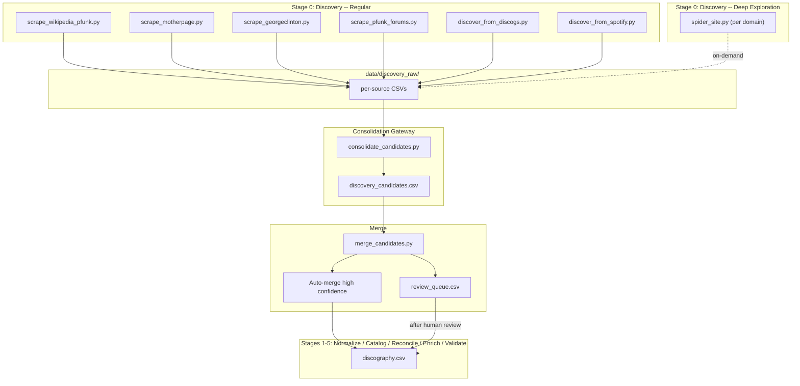

# P-Funk Archive

## What This Is

Structured discography archive of Parliament, Funkadelic, and associated
acts (1956--present). Data is stored as CSV with automated pipelines for
discovery, enrichment, validation, and quality control.

## Scope

### Core Acts

Parliament and Funkadelic in all configurations and name variants.

### Associated Acts

Included when there is direct P-Funk member involvement:

- Solo projects by core members (George Clinton, Bootsy Collins, Eddie
  Hazel, Bernie Worrell, Junie Morrison, Gary Shider, Michael Hampton,
  etc.)
- Side projects and spin-off bands with significant P-Funk personnel
  (Bootsy's Rubber Band, The Brides of Funkenstein, Parlet, The Horny
  Horns, Sweat Band, P-Funk All Stars, etc.)
- Session work where P-Funk members are credited performers, arrangers,
  or producers

### Exclusions

- Artists who only sampled P-Funk recordings without member involvement
- Covers by unrelated artists
- Tribute albums not featuring P-Funk members
- Compilations assembled by labels without new material or member
  participation beyond licensing

## Why It Exists

End goal is an interactive website for exploring P-Funk connections,
creating playlists, and embedded videos. Current focus is data quality and
completeness through automated, idempotent pipelines.

## Architecture



## Schema

22 columns in `data/discography.csv`, grouped as follows:

- **Identity:** artist, song_name, album_name, track_position
- **Classification:** row_type, release_category, edition_type, version_type
- **Release info:** release_date, label, era, genre
- **Recognition:** chart_position, awards
- **Links:** spotify_url, youtube_url, duration_seconds
- **Lineage:** alternative_names, source_release_id, work_id, version_id, notes

Full schema definition: `scripts/schema.py` and `AGENTS.md`

## Key Files

- `data/discography.csv` -- source of truth
- `data/discovery_seeds.csv` -- artist IDs
  (Discogs, MusicBrainz) for discovery crawlers
- `data/catalog_*.csv` -- derived relational views
  (artists, releases, tracks, works)
- `data/catalog_personnel.csv` -- credits from Discogs
- `data/url_search_log.json` -- enrichment provenance
- `scripts/schema.py` -- canonical schema definitions
- `AGENTS.md` -- agent instructions and project rules
- `docs/data-reliability-spec.md` -- detailed variant/duplicate
  resolution rules
- `data/.spotify_cache/`, `data/.youtube_cache/`,
  `data/.discogs_cache/` -- API caches (not committed)

## Pipeline

Six stages, run in order:

```text
Stage 0: Discover      scripts/0.discover/
Stage 1: Normalize     scripts/1.normalize/
Stage 2: Build Catalog scripts/2.catalog/
Stage 3: Reconcile     scripts/3.reconcile/
Stage 4: Enrich        scripts/4.enrich/
Stage 5: Validate      scripts/5.validate/
On-demand: Audit       scripts/audit/
```

### How to Run the Full Pipeline

```bash
# Full pipeline (automated, streams output live)
python3 scripts/run_pipeline.py

# Options:
python3 scripts/run_pipeline.py --stage 0        # single stage
python3 scripts/run_pipeline.py --skip-api        # skip API steps
python3 scripts/run_pipeline.py --dry-run         # show plan only
python3 scripts/run_pipeline.py --fresh           # clear enrichment checkpoints
python3 scripts/run_pipeline.py -q                # quiet (buffered output)

# Manual stage-by-stage execution:

# Stage 0: Discover
python3 scripts/0.discover/scrape_wikipedia_pfunk.py
python3 scripts/0.discover/scrape_motherpage.py --max-depth 3
python3 scripts/0.discover/scrape_georgeclinton.py --max-depth 3
python3 scripts/0.discover/scrape_pfunk_forums.py
python3 scripts/0.discover/discover_from_discogs.py
python3 scripts/0.discover/discover_from_spotify.py
python3 scripts/0.discover/consolidate_candidates.py
python3 scripts/0.discover/merge_candidates.py --write

# Stage 1: Normalize
python3 scripts/1.normalize/canonicalize_discography.py --write \
  --report-json reports/canonicalization/latest.json \
  --report-md reports/canonicalization/latest.md

# Stage 2: Build catalog
python3 scripts/2.catalog/build_catalog_relations.py

# Stage 3: Reconcile tracking
python3 scripts/3.reconcile/reconcile_tracking.py \
  --report-json reports/reconciliation/latest.json --write

# Stage 4: Enrich
python3 scripts/4.enrich/enrich_spotify.py
python3 scripts/4.enrich/enrich_youtube.py --limit 95 --resume
python3 scripts/4.enrich/enrich_personnel_from_discogs.py
python3 scripts/4.enrich/backfill_duration_from_cache.py
python3 scripts/4.enrich/backfill_spotify_from_cache.py

# Stage 5: Validate
python3 scripts/5.validate/detect_song_name_fuzzy_duplicates.py \
  --report-json reports/duplicates/song_name_fuzzy_latest.json \
  --report-md reports/duplicates/song_name_fuzzy_latest.md \
  --high-confidence-json reports/duplicates/high_confidence_candidates.json \
  --high-confidence-md reports/duplicates/high_confidence_candidates.md
python3 scripts/5.validate/quality_gates.py \
  --report-json reports/quality/quality_latest.json \
  --report-md reports/quality/quality_latest.md
python3 scripts/5.validate/validate_discography.py
python3 scripts/5.validate/validate_schema.py
```

### Deep Exploration

Run monthly or on-demand to crawl entire sites for content the targeted
scrapers miss. The spider discovers per-album detail pages, session work
credits, singles lists, forum threads, and Wikipedia infobox data.

```bash
python3 scripts/0.discover/spider_site.py \
  https://mother.pfunkarchive.com/ --extract --max-depth 3
python3 scripts/0.discover/spider_site.py \
  https://georgeclinton.com/music/ --extract --max-depth 2
python3 scripts/0.discover/spider_site.py \
  https://pfunkforums.com/ \
  --extract --max-depth 2 --url-pattern '/t/|/c/'
python3 scripts/0.discover/spider_site.py \
  'https://en.wikipedia.org/wiki/List_of_P-Funk_projects' \
  --extract --max-depth 2 --url-pattern '/wiki/'

# Then run consolidation and merge as usual
python3 scripts/0.discover/consolidate_candidates.py
python3 scripts/0.discover/merge_candidates.py --write
```

### Cache Bypass

All scrapers and crawlers support `--force` to re-fetch everything.
Granular options:

- Scrapers: `--force-page URL` to re-fetch a specific page
- API crawlers: `--force-artist NAME_OR_ID` to re-crawl a specific artist
- Spider: `--force-page URL` to re-fetch a specific cached page

### Environment Variables

Credentials are loaded automatically from `.env` or `.env.local` at the
project root via `python-dotenv`. No manual `export` or `source` is
needed -- just create the file and run the pipeline.

- **Spotify:** `SPOTIPY_CLIENT_ID`, `SPOTIPY_CLIENT_SECRET`
- **YouTube:** `YOUTUBE_API_KEY`
- **Discogs:** `DISCOGS_TOKEN`

### Spotify Link Quality Workflow

Run after validation when auditing existing Spotify URLs:

```bash
python3 scripts/audit/score_spotify_link_mismatches.py \
  --report-json reports/spotify_audit/mismatch_latest.json \
  --report-md reports/spotify_audit/mismatch_latest.md

python3 scripts/audit/quarantine_suspicious_spotify_links.py \
  --audit-json reports/spotify_audit/mismatch_latest.json \
  --report-json reports/spotify_audit/quarantine_latest.json \
  --report-md reports/spotify_audit/quarantine_latest.md \
  --write

python3 scripts/audit/repopulate_spotify_high_confidence.py \
  --report-json reports/spotify_audit/repopulate_latest.json \
  --report-md reports/spotify_audit/repopulate_latest.md
```

## Repository Structure

```text
pfunk-archive/
├── data/
│   ├── discography.csv              # source of truth
│   ├── discovery_seeds.csv          # artist IDs (Discogs, MusicBrainz) for crawlers
│   ├── url_search_log.json          # enrichment provenance
│   ├── catalog_artists.csv          # derived
│   ├── catalog_releases.csv         # derived
│   ├── catalog_tracks.csv           # derived
│   ├── catalog_works.csv            # derived
│   ├── catalog_personnel.csv        # credits from Discogs
│   ├── .spotify_cache/              # local only
│   ├── .youtube_cache/              # local only
│   ├── .discogs_cache/              # local only
│   └── .discovery_cache/            # local only
├── docs/
│   └── data-reliability-spec.md     # detailed variant/duplicate rules
├── reports/                         # generated, not committed
├── scripts/
│   ├── schema.py                    # canonical column/enum definitions
│   ├── run_pipeline.py              # full pipeline runner
│   ├── 0.discover/                  # Stage 0: Discovery
│   │   ├── scrape_wikipedia_pfunk.py
│   │   ├── scrape_motherpage.py
│   │   ├── scrape_georgeclinton.py
│   │   ├── scrape_pfunk_forums.py
│   │   ├── discover_from_discogs.py
│   │   ├── discover_from_spotify.py
│   │   ├── spider_site.py
│   │   ├── consolidate_candidates.py
│   │   └── merge_candidates.py
│   ├── 1.normalize/                 # Stage 1
│   │   └── canonicalize_discography.py
│   ├── 2.catalog/                   # Stage 2
│   │   └── build_catalog_relations.py
│   ├── 3.reconcile/                 # Stage 3
│   │   └── reconcile_tracking.py
│   ├── 4.enrich/                    # Stage 4
│   │   ├── enrich_spotify.py
│   │   ├── enrich_youtube.py
│   │   ├── enrich_personnel_from_discogs.py
│   │   ├── backfill_duration_from_cache.py
│   │   └── backfill_spotify_from_cache.py
│   ├── 5.validate/                  # Stage 5
│   │   ├── detect_song_name_fuzzy_duplicates.py
│   │   ├── quality_gates.py
│   │   ├── validate_discography.py
│   │   └── validate_schema.py
│   └── audit/                       # On-demand
│       ├── score_spotify_link_mismatches.py
│       ├── quarantine_suspicious_spotify_links.py
│       ├── repopulate_spotify_high_confidence.py
│       ├── generate_spotify_mismatch_queue.py
│       └── generate_youtube_gap_queue.py
├── AGENTS.md                        # agent instructions and project rules
├── requirements.txt
└── README.md
```

## Operational Rules

- Cache-first enrichment: prefer local cache over API calls.
- No hardcoded credentials: use environment variables.
- One canonical source per rule set: avoid duplicating logic.
- Reports are evidence artifacts: treat generated reports as immutable for
  audit.
- Discovery is additive: never delete or overwrite existing discography rows.

## Notes

This is an informational research project. All artist, release, and media
rights belong to their respective owners.
